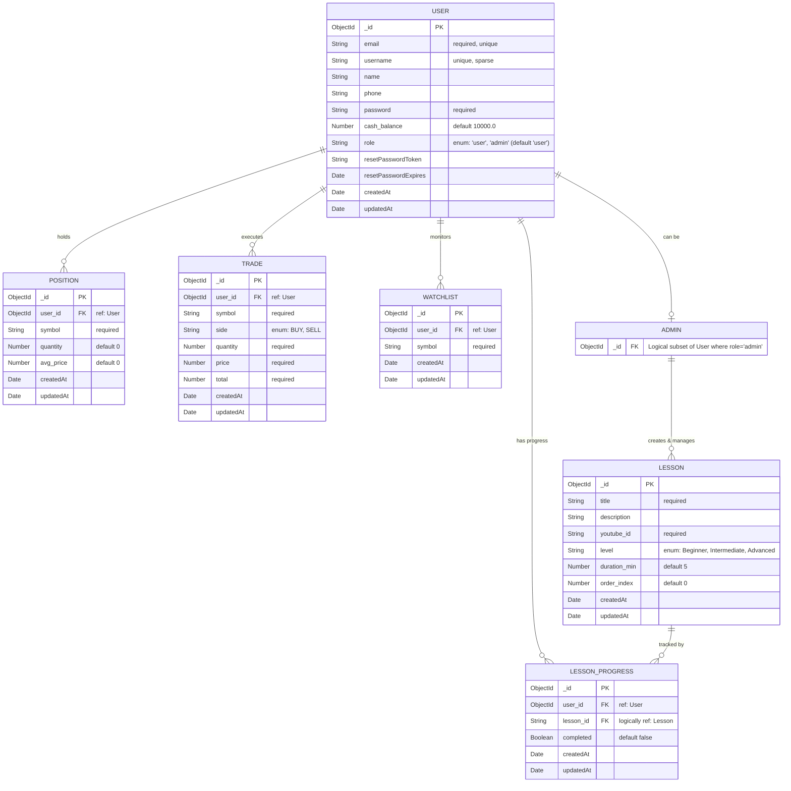

# LearnChart Quest Database Schema (ERD)

This diagram outlines the complete database table (collection) structure and relationships based on the Mongoose models. It explicitly highlights the **Admin** role and its conceptual relationships within the system.

## Collections & Roles Breakdown

1.  **User**: Stores all users, distinguished by the `role` field.
    - **Regular Users (`role: "user"`)**: Can trade (Positions, Trades, Watchlist) and learn (LessonProgress).
    - **Admins (`role: "admin"`)**: Have the authority to manage the curriculum (create, update, delete `Lesson` documents) and oversee the platform.
2.  **Lesson**: The curriculum catalog containing details about educational videos and content. While not strictly bound by a foreign key to a specific creator, these are conceptually managed exclusively by **Admins**.
3.  **LessonProgress**: Tracks which lessons a particular user has completed. It references the `User` and logically refers to the `Lesson` via `lesson_id`.
4.  **Position**: Represents a user's current open holdings in the market (paper trading portfolio).
5.  **Trade**: A historical log of buy/sell orders executed by the user.
6.  **Watchlist**: Stock symbols that a user has marked to keep an eye on.
